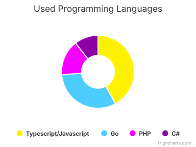
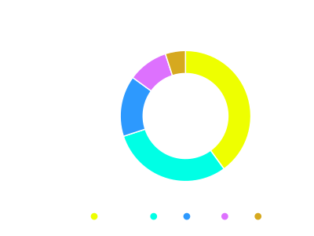

  

 

- Name: **Radhofan Azizi Ramdhani (Radho)**.

- From: **Jakarta, West Java, Indonesia**.

- Role: **Fullstack Developer** & **Open Source Contributor**.

- Graduated: [**Computer Science**](https://telkomuniversity.ac.id/fakultas-informatika/) at **Tel-U**.

- Currently developing [splsh](https://github.com/radhofan/splsh),
  **Golang based fast environment running tool**.

- Feel free to reach out if you want to work with me!.
    
    

  

<h3>My Tech Stack:</h3>

  
  
  
  

 

  
  
  
  
  
  
  

 

  
  
  
  

 

  
  
  
  

<!--  -->

  

<!-- 
<svg version="1.1" style="font-family: Inter; font-size: 12px;" xmlns="http://www.w3.org/2000/svg" width="400" height="300" viewBox="0 0 550 400" aria-hidden="false" aria-label="Interactive chart"><rect fill="transparent" x="0" y="0" width="650" height="400" rx="0" ry="0"/><rect fill="none" x="10" y="46" width="630" height="301"/><g data-z-index="0" aria-hidden="true"/><rect fill="none" data-z-index="1" x="10" y="46" width="500" height="301"/><g data-z-index="3" aria-hidden="false"><g data-z-index="0.1" opacity="1" transform="translate(10,46) scale(1 1)" style="cursor: pointer;" aria-hidden="false"><path fill="#eeff00" d="M 314.97669978549726 36.100002372814686 A 114.4 114.4 0 0 1 382.37933169639655 242.95207223284385 L 381.79035152422523 242.143924748291 A 113.4 113.4 0 0 0 314.976903458701 37.100002352073304 Z" data-z-index="-1" fill-opacity="0.25" visibility="hidden"/><path fill="#eeff00" d="M 314.97669978549726 36.100002372814686 A 114.4 114.4 0 0 1 382.37933169639655 242.95207223284385 L 358.7965656026577 210.5938469513485 A 74.36 74.36 0 0 0 314.98485486057325 76.14000154232956 Z" transform="translate(0,0)" stroke="#ffffff" stroke-width="2" opacity="1" stroke-linejoin="round" tabindex="-1" style="outline: none;" role="img" aria-label="Javascript, 80."/><path fill="#00ffe5" d="M 382.2868459499093 243.0194053272781 A 114.4 114.4 0 0 1 206.24991877702644 186.00746166648156 L 244.3124472050672 173.57985008321302 A 74.36 74.36 0 0 0 358.736449867441 210.63761346273077 Z" transform="translate(0,0)" stroke="#ffffff" stroke-width="2" opacity="1" stroke-linejoin="round" tabindex="-1" style="outline: none;" role="img" aria-label="Go, 60."/><path fill="#2d99fe" d="M 206.21446569631397 185.89869384965425 A 114.4 114.4 0 0 1 222.38722384088214 83.34172655509128 L 254.8016954965734 106.84712226080933 A 74.36 74.36 0 0 0 244.2894027026041 173.50915100227527 Z" transform="translate(0,0)" stroke="#ffffff" stroke-width="2" opacity="1" stroke-linejoin="round" tabindex="-1" style="outline: none;" role="img" aria-label="PHP, 30."/><path fill="#dd71fe" d="M 222.45442840951821 83.24914737350157 A 114.4 114.4 0 0 1 279.5146885474372 41.74268911418133 L 291.9345475558342 79.80774792421786 A 74.36 74.36 0 0 0 254.84537846618684 106.78694579277602 Z" transform="translate(0,0)" stroke="#ffffff" stroke-width="2" opacity="1" stroke-linejoin="round" tabindex="-1" style="outline: none;" role="img" aria-label="C#, 20."/><path fill="#d6a91f" d="M 279.62346358285106 41.707258187293874 A 114.4 114.4 0 0 1 314.8411006950846 36.10011035402657 L 314.896715451805 76.14007173011727 A 74.36 74.36 0 0 0 292.0052513288532 79.78471782174103 Z" transform="translate(0,0)" stroke="#ffffff" stroke-width="2" opacity="1" stroke-linejoin="round" tabindex="-1" style="outline: none;" role="img" aria-label="Java, 10."/></g><g data-z-index="0.1" opacity="1" transform="translate(10,46) scale(1 1)" aria-hidden="true"/></g><text x="325" text-anchor="middle" data-z-index="4" style="color: #ffffff; font-size: 18px; fill: #ffffff;" y="24" aria-hidden="true" font-family="Inter-Regular,Inter">Top Programming Languages</text><text x="325" text-anchor="middle" data-z-index="4" style="color: #ffffff; fill: #ffffff;" y="45" aria-hidden="true" font-family="Inter-Regular,Inter"/><text x="10" text-anchor="start" data-z-index="4" style="color: #ffffff; fill: #ffffff;" y="397" aria-hidden="true" font-family="Inter-Regular,Inter"/><g data-z-index="7" aria-hidden="true" transform="translate(149,359)"><rect fill="none" rx="0" ry="0" x="0" y="0" width="352" height="26"/><g data-z-index="1"><g><g data-z-index="1" transform="translate(8,3)"><text x="21" style="color: #ffffff; cursor: pointer; font-size: 12px; font-weight: bold; fill: #ffffff;" text-anchor="start" data-z-index="2" y="15" font-family="Inter-Regular,Inter">Javascript</text><rect x="2" y="4" width="12" height="12" fill="#eeff00" rx="6" ry="6" data-z-index="3"/></g><g data-z-index="1" transform="translate(112.16666793823242,3)"><text x="21" y="15" style="color: #ffffff; cursor: pointer; font-size: 12px; font-weight: bold; fill: #ffffff;" text-anchor="start" data-z-index="2" font-family="Inter-Regular,Inter">Go</text><rect x="2" y="4" width="12" height="12" fill="#00ffe5" rx="6" ry="6" data-z-index="3"/></g><g data-z-index="1" transform="translate(170.18333435058594,3)"><text x="21" y="15" style="color: #ffffff; cursor: pointer; font-size: 12px; font-weight: bold; fill: #ffffff;" text-anchor="start" data-z-index="2" font-family="Inter-Regular,Inter">PHP</text><rect x="2" y="4" width="12" height="12" fill="#2d99fe" rx="6" ry="6" data-z-index="3"/></g><g data-z-index="1" transform="translate(236.73333358764648,3)"><text x="21" y="15" style="color: #ffffff; cursor: pointer; font-size: 12px; font-weight: bold; fill: #ffffff;" text-anchor="start" data-z-index="2" font-family="Inter-Regular,Inter">C#</text><rect x="2" y="4" width="12" height="12" fill="#dd71fe" rx="6" ry="6" data-z-index="3"/></g><g data-z-index="1" transform="translate(294.96666717529297,3)"><text x="21" y="15" style="color: #ffffff; cursor: pointer; font-size: 12px; font-weight: bold; fill: #ffffff;" text-anchor="start" data-z-index="2" font-family="Inter-Regular,Inter">Java</text><rect x="2" y="4" width="12" height="12" fill="#d6a91f" rx="6" ry="6" data-z-index="3"/></g></g></g></g></svg>
 -->
<!--  
 

 
 
 
  -->

<!-- BLOG_RSS_START -->

- 👷 [**My Blogs - Under development, please wait**](https://example.com/blog-1)
- 👷 [**My Blogs - Under development, please wait**](https://example.com/blog-2)
- 👷 [**My Blogs - Under development, please wait**](https://example.com/blog-3)
- 👷 [**My Blogs - Under development, please wait**](https://example.com/blog-4)
- 👷 [**My Blogs - Under development, please wait**](https://example.com/blog-5)
- 👷 [**My Blogs - Under development, please wait**](https://example.com/blog-6)
- 👷 [**My Blogs - Under development, please wait**](https://example.com/blog-7)
- 👷 [**My Blogs - Under development, please wait**](https://example.com/blog-8)
- 👷 [**My Blogs - Under development, please wait**](https://example.com/blog-9)
- 👷 [**My Blogs - Under development, please wait**](https://example.com/blog-10)
    
   
   

<!-- BLOG_RSS_END -->

 
“The strength gained through my own hard work is truly fulfilling. Hehe, thanks for your support.” – Furina&nbsp;&nbsp;&nbsp;&nbsp;&nbsp;&nbsp;&nbsp;&nbsp;&nbsp;&nbsp;&nbsp;&nbsp;&nbsp;&nbsp;&nbsp;&nbsp;&nbsp;&nbsp;&nbsp;&nbsp;&nbsp;&nbsp;&nbsp;&nbsp;&nbsp;&nbsp;&nbsp;&nbsp;&nbsp;&nbsp;contact : radhofanazizi@gmail.com
  

        

